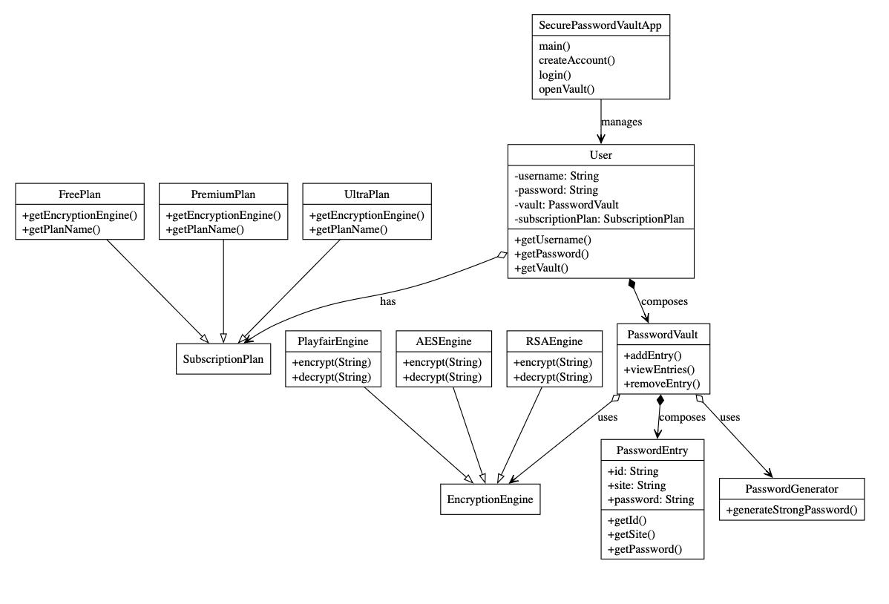

# Secure Password Vault

**Secure Password Vault** is a Java-based, object-oriented password management system that provides users with secure password storage, encryption, and subscription-based access levels. It uses different encryption algorithms depending on the user’s subscription plan — making it both a learning project for Object-Oriented Programming (OOP) and a practical tool.

---

## Table of Contents
- [Overview](#overview)
- [Features](#features)
- [OOP Concepts Used](#oop-concepts-used)
- [System Architecture (UML)](#system-architecture-uml)
- [Class & Component Breakdown](#class--component-breakdown)
- [Subscription Plans & Encryption Engines](#subscription-plans--encryption-engines)
- [How to Run](#how-to-run)
- [Extending the Project](#extending-the-project)
- [References](#references)

---

## Overview
**Secure Password Vault** allows users to:
- Create an account with a chosen subscription plan.
- Securely store, view, and remove passwords in an encrypted password vault.
- Generate strong random passwords.
- Access varying encryption and features based on subscription tier.

Passwords are **encrypted before storage** using the chosen encryption engine, ensuring privacy and security.

---

## Features
- Account Management – Create accounts and log in securely.
- Encrypted Password Vault – Store unlimited password entries securely.
- Multiple Encryption Algorithms – Powered by different subscription tiers:
  - Free Plan → Playfair Cipher
  - Premium Plan → RSA
  - Ultra Plan → AES
- Strong Password Generator – Built-in password generator using `SecureRandom`.
- Extensible – Add new encryption algorithms or subscription models easily.

---

## OOP Concepts Used

The project demonstrates strong use of **Object-Oriented Programming principles**:

- **Abstraction**  
  - `EncryptionEngine` and `SubscriptionPlan` are abstract classes that define essential behavior but leave implementation details to subclasses.
  
- **Encapsulation**  
  - Sensitive fields (`password`, `username`, `vault entries`) are private, exposing safe getters/setters.
  
- **Inheritance**  
  - `FreePlan`, `PremiumPlan`, and `UltraPlan` inherit from `SubscriptionPlan`.  
  - Encryption algorithms inherit from `EncryptionEngine`.

- **Polymorphism**  
  - Code interacts with `SubscriptionPlan` and `EncryptionEngine` in a generic way, letting actual implementations vary without modifying client code.

- **Composition**  
  - A `User` **has a** `PasswordVault`.  
  - `PasswordVault` **has** multiple `PasswordEntry` objects.  
  - This models real-world relationships.

- **Separation of Concerns**  
  - Business logic (Users, Plans, Vault) is separated from encryption logic and password generation.

---

## System Architecture (UML)

_UML Diagram (as per project design):_

- `SecurePasswordVaultApp` manages **users and vault interactions**.  
- A `User` is associated with a **SubscriptionPlan** and **PasswordVault**.  
- The **Vault** contains multiple password entries and uses an **EncryptionEngine**.  
- **SubscriptionPlans** determine which **EncryptionEngine** (AES, RSA, Playfair) is used.  
- `PasswordGenerator` provides secure password generation.  

---

## Class & Component Breakdown

### `SecurePasswordVaultApp`
Main class and CLI controller for signup, login, and opening password vault.

### `User`
Represents a registered user. Contains:
- `username`
- `password`
- Associated `SubscriptionPlan`
- Private `PasswordVault`

### `PasswordVault`
Secure vault for managing `PasswordEntry` objects. Handles:
- Add, view, and remove operations
- Encrypts and decrypts automatically
- Uses a `PasswordGenerator` for strong password creation

### `PasswordEntry`
Represents an individual login entry:
- `id`
- `site`
- `password` (stored encrypted in vault)

### `PasswordGenerator`
Generates strong random passwords using `SecureRandom`.

### `SubscriptionPlan` (abstract)
Defines basic plan blueprints: price, plan name, encryption engine.

- `FreePlan` → Uses Playfair cipher (`PlayfairEngine`)
- `PremiumPlan` → Uses RSA (`RSAEngine`)
- `UltraPlan` → Uses AES (`AESEngine`)

### `EncryptionEngine` (abstract)
Abstract representation of encryption/decryption engines.  
Implemented by:
- `AESEngine`
- `RSAEngine`
- `PlayfairEngine`

---

## Subscription Plans & Encryption Engines

| Plan       | Price  | Encryption | Engine Class     |
|------------|--------|------------|------------------|
| Free       | $0.00  | Playfair   | `PlayfairEngine` |
| Premium    | $9.99  | RSA        | `RSAEngine`      |
| Ultra      | $4.99  | AES        | `AESEngine`      |

---

## How to Run

1. **Clone the repository**
git clone https://github.com/your-username/secure-password-vault.git
cd secure-password-vault

2. **Compile the project** (JDK 8+ required)
javac Project/SecurePasswordVaultApp.java

3. **Run the main application**
java Project.SecurePasswordVaultApp

4. **Use the CLI**
- Create accounts
- Choose plans
- Store/manage encrypted passwords

---

## Extending the Project

- **Add New Plan**: Extend `SubscriptionPlan`, override methods for encryption & name.  
- **Add New Algorithm**: Extend `EncryptionEngine` with new `encrypt()` & `decrypt()` implementations.  
- **Enhance Security**: Add 2FA, password hashing for account login, or multi-device sync.  
- **Add GUI**: Replace CLI with JavaFX/Swing interface for better UX.  

---

## References
- [Object-Oriented Programming Concepts](https://en.wikipedia.org/wiki/Object-oriented_programming)  
- [Java SE Documentation](https://docs.oracle.com/javase/8/docs/)  
- [Java Cryptography Architecture](https://docs.oracle.com/javase/8/docs/technotes/guides/security/crypto/CryptoSpec.html)  

---

## Author
Developed by **Nathan Dsouza**  
Feel free to fork, contribute, or suggest improvements.

---

**Stay Secure!**  
*Your passwords deserve better protection.*
